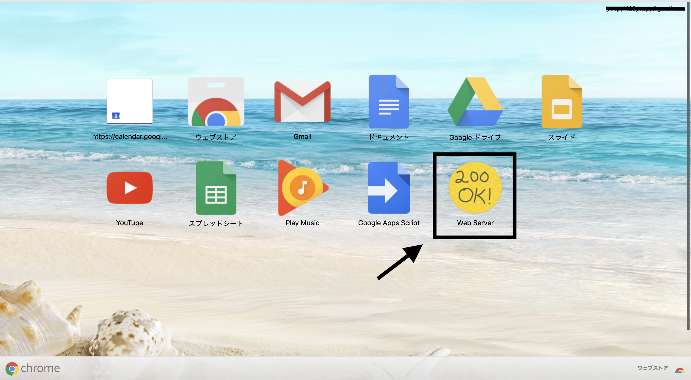
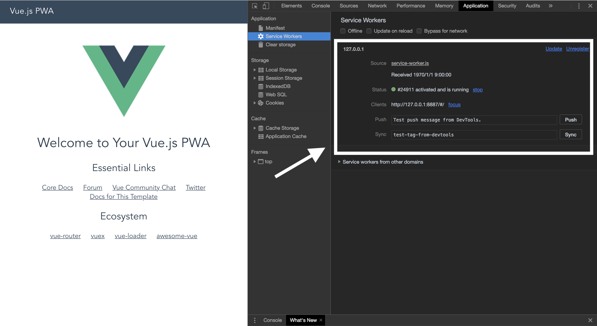

# vue-pwa-tutorial

**注** このアプリケーションは Vue-CLI2で実装されています。最新のバージョンはVue-CLI3なので気をつけてください。

---

## 環境構築、テンプレート作成

```
$ npm install -g vue-cli

$ vue init pwa vue-pwa-tutorial
# 基本的には全てEnterでOK

? Vue build standalone 
? Install vue-router? Yes
? Use ESLint to lint your code? Yes
? Setup unit tests with Karma + Mocha? No
? Setup e2e tests with Nightwatch? No

$ cd vue-pwa-tutorial
$ npm install
$ npm run dev
```

## ビルド
```
$ npm run build
```

## [Workboxの導入](https://github.com/yoshi1125hisa/vue-pwa-tutorial/commit/190c80d0948012a219536a1fe21ee33a954f94f7#diff-b837e8e89bbf621827a64e0b2b0c0aa5)
```
$ npm install workbox-webpack-plugin --save-dev
```

./build/webpack.prod.conf.js:line14
```
const SWPrecacheWebpackPlugin = require('sw-precache-webpack-plugin')
```
をコメントアウトし、
```
const WorkboxPlugin = require('workbox-webpack-plugin')
```
を追加。また、

```
new SWPrecacheWebpackPlugin({
    cacheId: 'easy-wallet',
    filename: 'service-worker.js',
    staticFileGlobs: ['dist/**/*.{js,html,css}'],
    minify: true,
    stripPrefix: 'dist/'
})
```
をコメントアウトし、
```
new WorkboxPlugin.GenerateSW({
    cacheId: 'easy-wallet',
    globDirectory: config.build.assetsRoot,
    globPatterns: ['**/*.{html,js,css,jpg,png}'],
    swDest: path.join(config.build.assetsRoot, 'service-worker.js'),
    skipWaiting: true,
    clientsClaim: true,
    runtimeCaching: []
})
```
を追加してください。

## [Webserver for Chrome](https://chrome.google.com/webstore/detail/web-server-for-chrome/ofhbbkphhbklhfoeikjpcbhemlocgigb) のインストール



## Serverを起動
`CHOOSE FOLDER` を押し、 `/dist`フォルダを選択してください。


`Web Server URL(s) http://XXX.X.X.X:XXXX` にアクセスすると、先ほど作成したページを開くことができるようになっています。

## ServiceWorkerの動作確認

